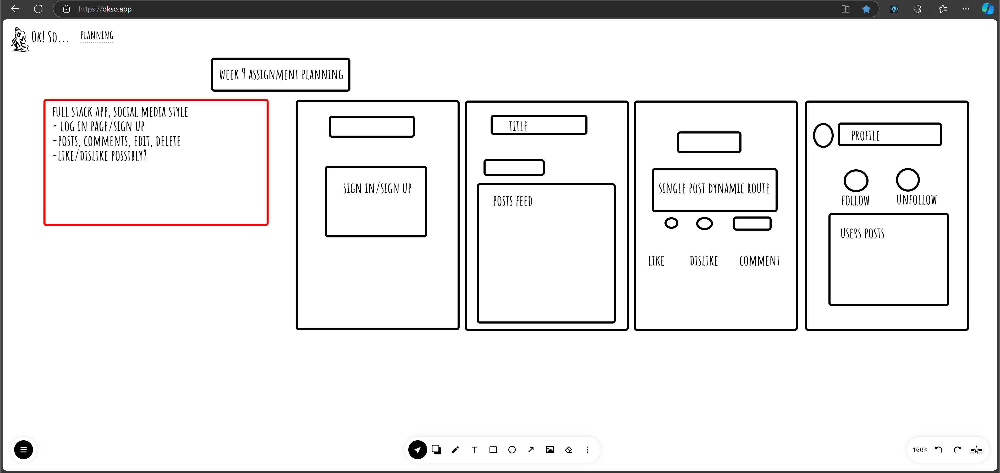
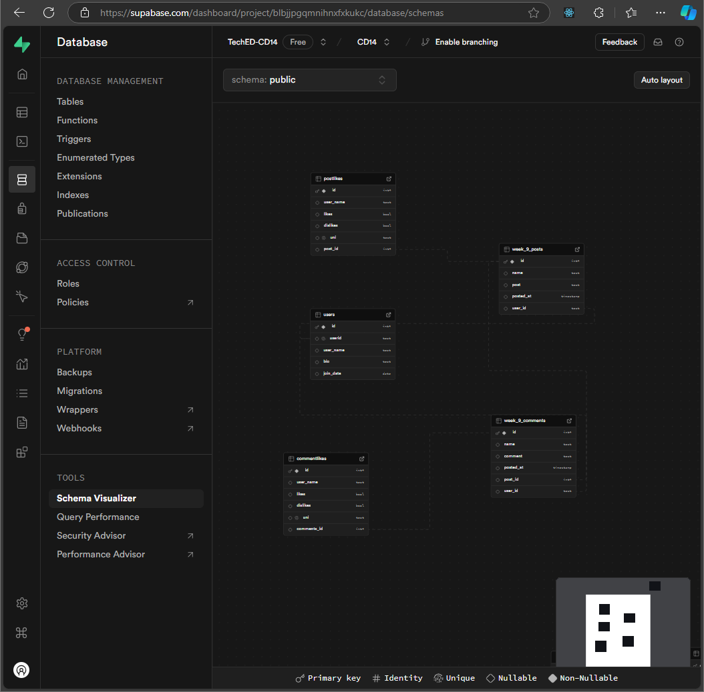

# links

# repo

https://github.com/djanth22/week-9-assignment

# deployment

https://week-9-assignment-brown.vercel.app/

# planning and schema

## reflection

# user requirements

- 🎯 Set up user sign-up and user login using Clerk.
- 🎯 Create and display an error page if the user visits a user profile that doesn’t exist.
- 🎯 Use 1 or more Radix UI Primitive or something similar (e.g. use of another library to enhance UX).
- 🎯 Enable users to create a user profile, and input profile information (such as a user biography) using a form. Users and user information should be stored in their own table in the database and handled with an appropriate route (e.g. /user/[userId]).
- 🎯 Enable users to create posts associated with their Clerk userId. Posts should be displayed on the user’s profile page.

# reflection points

Required

- 🎯 What requirements did you achieve?
- 🎯 Were there any requirements or goals that you were unable to achieve?
- 🎯 If so, what was it that you found difficult about these tasks?

Optional
🏹 Feel free to add any other reflections you would like to share about your submission, for example:

- Requesting feedback about a specific part of your submission.
- What useful external sources helped you complete the assignment (e.g YouTube tutorials)?
- What errors or bugs did you encounter while completing your assignment? How did you solve them?
- What went really well and what could have gone better?

# my reflection

what requirements I achieved

- my user can sign in or sign up using clerk
- i managed to get an accordian element from daisy ui working (radix ui wasnt working)
- users have a very basic profile where then can add a bio, users, posts, likes anf followers are all respectively stored in their own tables in the database
- users posts are associated with their clerk id

I didnt manage to get my error page working and had run out of time to mess with it and so I removed it, but this was one of the requirements I haven't been able to do. I lost a lot of time on this assignment due to unforseen circumstances but i had managed to get likes, dislikes, delete buttons and even a simple follow system more or less working which i'm happy with.
